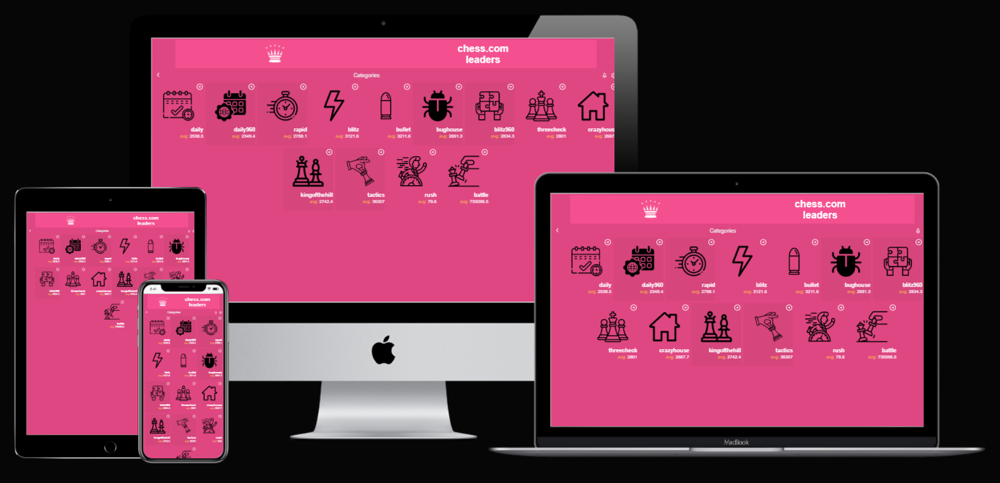

# Chess Leaders
> A web app that lets you check the leaders in all chess games modalities from chess.com.

## Built With

- JavaScript
- React
- Redux

## Live Demo
[Chess leaders](https://vicperalta.github.io/chess-leaders/)   

## Getting Started

To get a local copy follow these simple example steps.  

1.- Open the terminal window and clone the repository using this command:  
`git@github.com:VicPeralta/chess-leaders.git` 

2.- Change the directory to the react-bookstore directory  
`cd chess-leaders`  
3.- Install the project's dependencies by running this command:   
`npm install`  
4.- Generate the dist folder using this command:  
`npm run build`  
5.- Run this command to see the page `npm start`  
6.- To see the code open the project in the code editor of your preference.  

## Author

👤 **Victor Peralta**
- GitHub: [@VicPeralta](https://github.com/VicPeralta)
- Twitter: [@VicPeralta](https://twitter.com/VicPeralta)
- Linkedin: [@VicPeralta](https://www.linkedin.com/in/vicperalta/)

## 🤝 Contributing

Contributions, issues, and feature requests are welcome!

Feel free to check the [issues page](https://github.com/VicPeralta/chess-leaders/issues).

## Show your support

Give a ⭐️ if you like this project!

## Acknowledgments
- Original design by [Nelson Sakwa](https://www.behance.net/sakwadesignstudio)
- All icons from flaticon(<a href="https://www.flaticon.com/free-icons/year" title="year icons">Year icons created by Freepik - Flaticon</a>)
- A special thank for @fernandorpm for this amazing [README template](https://github.com/microverseinc/readme-template)

## 📝 License

This project is [MIT](./LICENSE.md) licensed.

